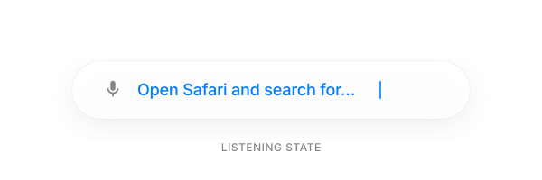
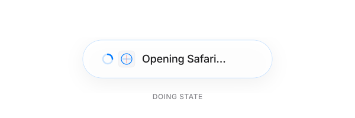
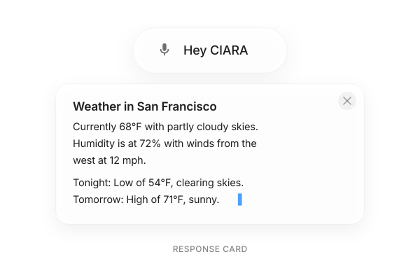
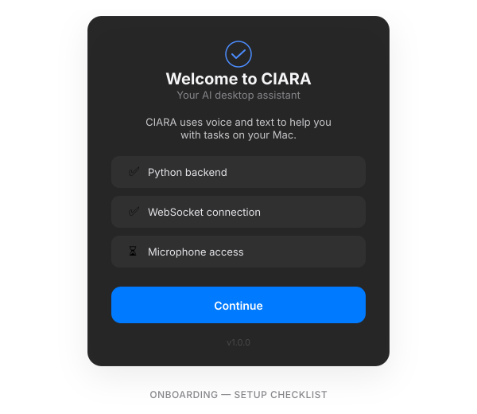
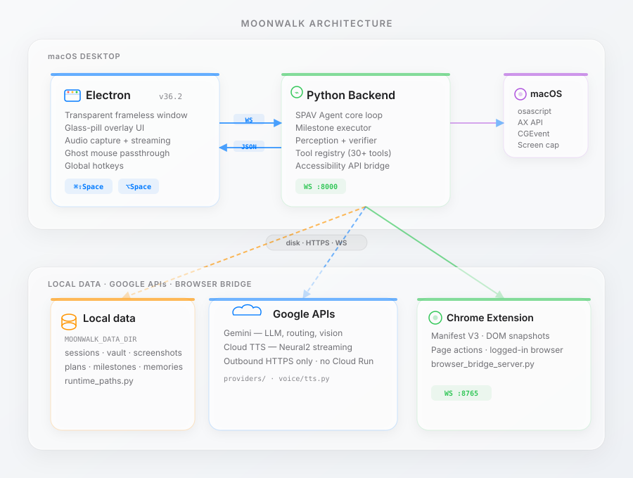
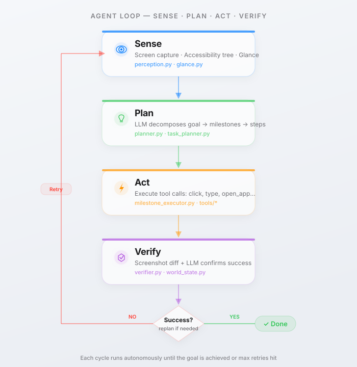

# CIARA

**Control Intelligence Assistant for Real-time Automation** — an AI desktop companion for macOS: a transparent glass-pill overlay that uses voice and text to control your Mac.

Built with Electron + Python. Thinks with LLMs. Acts through Accessibility APIs and AppleScript.

---

<p align="center">
  
</p>

---
Demo Video: [https://youtu.be/u3QoaT3pIMs]

## Features

- **Voice-first** — Say "Hey CIARA" or Press `⌘⇧Space`, speak naturally, watch it act
- **SPAV Agent** — Sense → Plan → Act → Verify loop with milestone-based execution
- **Multi-modal responses** — Cards, tables, rich text, step timelines, image viewer
- **Browser automation** — Chrome extension bridges web actions (search, fill forms, extract data)
- **Local-first** — Python backend and data stay on your machine under `CIARA_DATA_DIR` / `~/.ciara`; configure API keys for LLM/TTS providers as needed

---

## UI States

The glass pill morphs between four states:

<table>
<tr>
<td align="center"><strong>Idle</strong><br/><br/><code>220px</code> · mic icon + "Hey CIARA"</td>
<td align="center"><strong>Listening</strong><br/><br/><code>440px</code> · typewriter transcription</td>
</tr>
<tr>
<td align="center"><strong>Thinking</strong><br/><br/><code>140px</code> · bouncing dots</td>
<td align="center"><strong>Doing</strong><br/><br/><code>320px</code> · spinner + app icon + action</td>
</tr>
</table>

### Response Card & Plan Preview

<table>
<tr>
<td align="center"><br/><strong>Streaming response card</strong><br/>Markdown, KaTeX math, code blocks</td>
<td align="center"><br/><strong>Plan preview modal</strong><br/>Step-by-step with "Proceed" button</td>
</tr>
</table>

### Command Panel & Onboarding

<table>
<tr>
<td align="center"><br/><strong>Command panel</strong> (⌥Space)<br/>Type-to-prompt with send button</td>
<td align="center"><br/><strong>First-launch onboarding</strong><br/>Auto-checks + keyboard shortcuts</td>
</tr>
</table>

---

## Architecture

<p align="center">
  
</p>

### Agent Loop (SPAV)

<p align="center">
  
</p>

---

## Quick Start

```bash
# 1. Clone & install
git clone https://github.com/<your-org>/CIARA.git
cd CIARA
npm install

# 2. Python environment
chmod +x setup.sh && ./setup.sh
# — or manually —
python3 -m venv .venv && source .venv/bin/activate
pip install -r backend/requirements.txt

# 3. Environment variables
cp .env.example .env
# Fill in: GOOGLE_API_KEY

# 4. Launch
npm start
```

### Keyboard Shortcuts

| Shortcut | Action |
|----------|--------|
| `⌘⇧Space` | Activate voice input |
| `⌥Space` | Open command panel |
| `Esc` | Dismiss overlay |

---

## Project Structure

```
CIARA/
├── main.js                  # Electron main process
├── preload.js               # IPC bridge (auth, credentials, mouse)
├── package.json             # Electron + electron-builder config
├── setup.sh                 # Post-install Python venv setup
│
├── renderer/
│   ├── index.html           # Glass-pill overlay markup
│   ├── styles.css           # Full UI styling (glassmorphism, modals)
│   └── renderer.js          # State machine, WS client, audio, modals
│
├── backend/
│   ├── runtime_paths.py     # Local data directory layout
│   ├── runtime_state.py     # Session / browser runtime snapshot
│   ├── agent/
│   │   ├── core_v2.py       # SPAV agent loop
│   │   ├── planner.py       # LLM task decomposition
│   │   ├── milestone_executor.py  # Step-by-step execution
│   │   ├── perception.py    # Screen reading + accessibility
│   │   ├── verifier.py      # Post-action verification
│   │   ├── glance.py        # Parallel screen perception
│   │   ├── memory.py        # Conversation memory
│   │   └── world_state.py   # Environment tracking
│   ├── browser/
│   │   ├── bridge.py        # Chrome extension WebSocket bridge
│   │   ├── search.py        # Web search via extension
│   │   └── selector_ai.py   # AI-powered DOM selector
│   ├── servers/
│   │   ├── local_server.py  # WebSocket backend (Electron uses this)
│   │   └── mac_client.py    # Deprecated shim → local_server
│   └── tools/               # Tool implementations (click, type, etc.)
│
├── chrome_extension/
│   ├── manifest.json        # MV3 manifest
│   ├── background.js        # Service worker
│   ├── content_script.js    # Page interaction
│   ├── popup.html/js        # Extension popup
│   └── options.html/js      # Bridge URL + auth config
│
├── docs/
│   ├── GUIDE.md             # Full build/test/distribute guide
│   └── screenshots/         # UI mockup SVGs
│
├── tests/                   # Test suite
└── benchmarks/              # Quality & intelligence benchmarks
```

---

## 🧩 Chrome Extension

The **CIARA Browser Bridge** extension enables web automation:

1. Install from `chrome_extension/` → `chrome://extensions` → Load unpacked
2. Open **Options** → set Bridge URL + Auth Token
3. The agent can now search the web, extract listings, fill forms, and interact with pages

---

## 🧪 Testing

```bash
# Run full test suite
cd tests && bash run_test.sh

# Individual tests
python -m pytest tests/test_agent_v2.py -v
python -m pytest tests/test_milestone_executor.py -v
python -m pytest tests/test_browser_scenarios.py -v

# Benchmarks
python benchmarks/run_benchmarks.py
```

---

## 📦 Building for Distribution

```bash
# Build universal macOS DMG
npx electron-builder --mac --universal

# Output: dist/CIARA-1.0.0-universal.dmg
```

See [docs/GUIDE.md](docs/GUIDE.md) for icon creation, code signing, notarization, and distribution via GitHub Releases.

---

## 📝 License

MIT

---

<p align="center">
  <strong>CIARA</strong> — Your AI copilot for macOS<br/>
  <sub>Voice-first · Glass UI · SPAV Agent · Local-first</sub>
</p>
